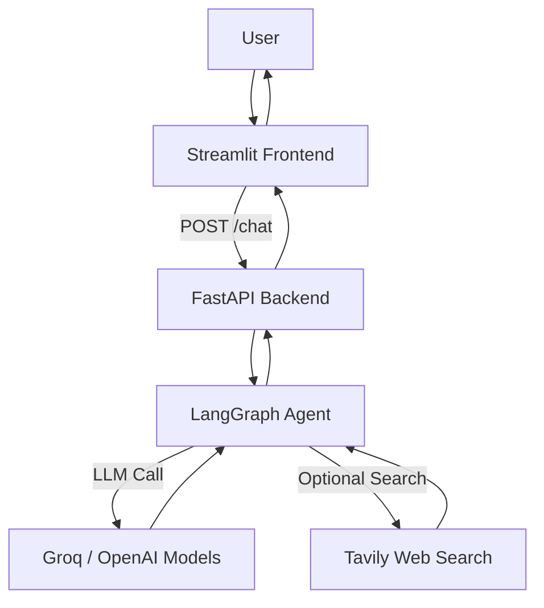

# 🤖 Agentic Chatbot with LangGraph, FastAPI & Streamlit  

An end-to-end **AI Agentic Chatbot Platform** that allows users to create and interact with custom intelligent chatbot agents.  
The project integrates **LangGraph**, **Groq / OpenAI LLMs**, and **Tavily Web Search**, with a **FastAPI backend** and a **Streamlit frontend**.  
It is fully **Dockerized** and deployed on **AWS EC2** with CI/CD via GitHub Actions.  

---

## ✨ Features  

- 📝 Define **system prompts** to customize agent personality.  
- 🤝 Supports **Groq** (LLaMA, Mixtral) and **OpenAI GPT** models.  
- 🌍 Optional **real-time web search** with Tavily integration.  
- 💬 Persistent chat history in Streamlit UI.  
- ⚡ FastAPI backend for API-driven responses.  
- 📦 Containerized with Docker & Docker Compose.  
- ☁️ Deployed on **AWS EC2** with **CI/CD** automation.  

---

## 🏗️ Architecture  



## ⚙️ Tech Stack  

- **Frontend:** Streamlit  
- **Backend:** FastAPI  
- **Agent Framework:** LangGraph + LangChain  
- **LLMs:** Groq (`llama-3.3`, `mixtral`), OpenAI (`gpt-4o-mini`)  
- **Tools:** Tavily Web Search  
- **Deployment:** Docker, Docker Compose, AWS EC2  
- **CI/CD:** GitHub Actions  


## 🚀 Getting Started

### 1. Clone the repository
```bash
git clone https://github.com/Npps1997/AGENTIC-CHATBOT.git
cd AGENTIC-CHATBOT
```

### 2. Create virtual environment
```bash
python -m venv venv
source venv/bin/activate   # On Windows: venv\Scripts\activate
```

### 3. Install dependencies
```bash
pip install -r requirements.txt
```

### 4. Setup environment variables

Create a .env file in the project root:
```ini
GROQ_API_KEY=your_groq_key_here
OPENAI_API_KEY=your_openai_key_here
TAVILY_API_KEY=your_tavily_key_here
```

### 5. Run Backend (FastAPI)
```bash
uvicorn backend:app --reload --host 127.0.0.1 --port 9999
```

### 6. Run Frontend (Streamlit)
```bash
streamlit run frontend.py
```

## 🐳 Docker Deployment

Build & Run
```bash
docker-compose up --build -d
```

Access Services

- Streamlit UI: http://<EC2-IP>:8501
- FastAPI Backend: http://<EC2-IP>:9999

## ☁️ AWS Deployment

- Launch EC2 (Ubuntu 22.04, t2.medium recommended).
- Install Docker & Docker Compose.
- Pull repo & deploy with:
```bash
docker-compose up --build -d
```
- CI/CD via GitHub Actions (.github/workflows/deploy.yaml) for automated deployment.

## 📌 Roadmap / Future Enhancements

- 🔒 Add authentication (JWT/OAuth).
- 🧠 Integrate vector database (Pinecone/Weaviate) for RAG.
- 🤖 Multi-agent collaboration.
- 💾 Persistent DB storage for chat history.

✨ If you like this project, don’t forget to ⭐ star the repo!

